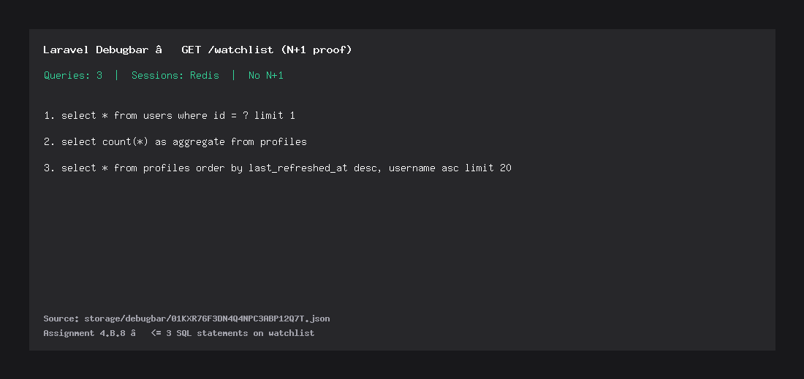

# FindYourInfluencer

Internal admin tool to track Instagram profiles, refresh them through queued jobs, and store time-series snapshots in PostgreSQL.

| | |
|---|---|
| **Stack** | Laravel 12 · Inertia v2 · React 19 + TypeScript · Tailwind · PostgreSQL · Redis · Pest |
| **Provider** | Apify `apify~instagram-profile-scraper` |
| **Repo** | https://github.com/kai2o/find-your-influencer |

---

## Features

- Watchlist CRUD: search, status filter, pagination, add handle, detail with deltas, re-fetch
- Queued `FetchProfileJob` (never HTTP from controllers)
- Scheduler every **10 minutes**; refreshes profiles older than **1 hour**
- Postgres advisory locks (Redis NX fallback on SQLite)
- Token bucket + IST daily quota · circuit breaker · retry classification
- HMAC webhooks + replay protection · `/healthz` · Performance ops dashboard

---

## Quick start (< 10 minutes)

### Prerequisites

- PHP 8.2+ (`curl`, `mbstring`, `openssl`, `pdo_pgsql` or `pdo_sqlite`, `zip`)
- Composer, Node 20+, Redis
- PostgreSQL recommended (required for advisory locks / submission-style runs)
- **Windows HTTPS:** point `php.ini` at a CA bundle (see [SSL on Windows](#ssl-on-windows) below)

### Install

```bash
git clone https://github.com/kai2o/find-your-influencer.git
cd find-your-influencer
cp .env.example .env
composer install
php artisan key:generate
```

Configure `.env` (Postgres example):

```env
DB_CONNECTION=pgsql
DB_HOST=127.0.0.1
DB_PORT=5432
DB_DATABASE=findyourinfluencer
DB_USERNAME=postgres
DB_PASSWORD=secret

QUEUE_CONNECTION=redis
CACHE_STORE=redis
SESSION_DRIVER=redis

PROFILE_PROVIDER=apify   # or fake
APIFY_TOKEN=your_token
WEBHOOK_SECRET=change-me
```

```bash
php artisan migrate
php artisan db:seed
npm install
npm run build
```

### Run (3 terminals)

```bash
php artisan serve --host=127.0.0.1 --port=8000
php artisan queue:work redis --tries=3 --timeout=120
php artisan schedule:work
```

| URL | |
|---|---|
| App | http://127.0.0.1:8000 |
| Login | `admin@example.com` / `password` |
| Health | http://127.0.0.1:8000/healthz |
| Performance | http://127.0.0.1:8000/performance |

**Seeds**

- `php artisan db:seed` — admin + ≥ 3 sample profiles  
- `php artisan db:seed --class=BenchmarkSeeder` — ≥ 1,000 profiles + ≥ 10,000 snapshots (EXPLAIN proofs)

Scheduler ticks on `:00/:10/:20/:30/:40/:50`. A tick with `dispatched_count = 0` is success (nothing older than 1 hour).

---

## SSL on Windows

Apify calls need a CA bundle or PHP fails with cURL error 60.

1. Download https://curl.se/ca/cacert.pem into `storage/certs/cacert.pem` (gitignored — do not commit secrets/bundles if large).
2. In `php.ini`:

```ini
curl.cainfo = "C:/full/path/to/storage/certs/cacert.pem"
openssl.cafile = "C:/full/path/to/storage/certs/cacert.pem"
```

3. Restart `serve` and `queue:work`.

Details: [storage/certs/README.md](storage/certs/README.md).

---

## Environment

| Variable | Purpose |
|---|---|
| `APIFY_TOKEN` | Apify API token (never commit) |
| `APIFY_ACTOR_ID` | Default `apify~instagram-profile-scraper` |
| `PROFILE_PROVIDER` | `apify` or `fake` |
| `API_DAILY_QUOTA` | Daily ceiling (IST-dated Redis key), default `1000` |
| `TOKEN_BUCKET_CAPACITY` | Token bucket size, default `100` |
| `TOKEN_BUCKET_REFILL_PER_MINUTE` | Refill rate, default `10` |
| `RATE_LIMITS_ENABLED` | `true`/`false` — when false, bucket + quota always allow |
| `WEBHOOK_SECRET` | HMAC secret for `POST /webhooks/{provider}` |
| `QUEUE_CONNECTION` / `CACHE_STORE` | Prefer `redis` |
| `GOOGLE_*` | Optional Google OAuth on login |

---

## Design notes

### Concurrency

**Chosen:** Postgres `pg_try_advisory_lock(profile_id)`.

Released in `finally` so a dropped DB connection unlocks. On SQLite/local: Redis `SET NX EX 120` (TTL above connect 3s + typical Apify run; prefer Postgres in production).

Proof: `tests/Feature/ConcurrencyTest.php` — held lock → 0 HTTP calls; unlock → exactly 1.

### Rate limit + quota

- **Token bucket:** capacity `TOKEN_BUCKET_CAPACITY` (default **100**), refill `TOKEN_BUCKET_REFILL_PER_MINUTE` (default **10**/min); empty → delayed re-dispatch (not a failed attempt)
- **Daily quota:** Redis `quota:YYYY-MM-DD` (Asia/Kolkata); refuse at 90% of `API_DAILY_QUOTA` (default 1000)
- **Bypass switch:** `RATE_LIMITS_ENABLED=false` skips bucket + quota checks (circuit breaker still applies)
- **HTTP:** connect timeout **3s**, read timeout **60s**

**Latency:** Apify’s sync actor typically takes **~8–15s** — that dominates add/refetch time, not the token bucket. For instant Loom demos set `PROFILE_PROVIDER=fake` (job runs inline via `dispatchSync`). Live Apify stays queued; detail UI polls every **500ms** while pending/fetching.

Before recording, reset Redis guards if a prior failure opened the circuit:

```bash
php artisan tinker --execute="Illuminate\Support\Facades\Redis::del('api:token-bucket','circuit:apify:failures','circuit:apify:open_until','circuit:apify:half_open');"
```

### Benchmark timings

```bash
php artisan profiles:benchmark-fetch cristiano nasa --job
```

Reports provider `api_ms` and full job path `job_ms` (lock + quota + bucket + snapshot). Sample local run with `PROFILE_PROVIDER=fake`:

| handle | api_ms | job_ms |
|---|---:|---:|
| demo_handle_a | 200 | 234 |
| demo_handle_b | 2 | 25 |

(First call includes cold DB/ops overhead; steady-state job is typically tens of ms.) With Apify, api/job are usually **multi-second** (~8–15s).

### Circuit breaker

```text
closed --[10 consecutive failures]--> open
open --[2 minutes]--> half_open
half_open --[probe success]--> closed
half_open --[probe failure]--> open
```

Open → `release(120)` (deferred, not a failed attempt). Redis keys under `circuit:apify:*`.

### Observability

- JSON job logs: `job_id`, `profile_id`, `attempt`, `duration_ms`, `outcome`
- `GET /healthz` — 200 if DB + Redis OK and a job ran in the last 5 minutes; else 503
- `/performance` — scheduler/job/api/webhook timeline + SQL captured during ops runs

### Benchmark fetches

```bash
php artisan profiles:benchmark-fetch cristiano nasa natgeo
php artisan profiles:benchmark-fetch cristiano --persist
php artisan profiles:benchmark-fetch cristiano nasa --job
```

---

## EXPLAIN ANALYZE

After `php artisan db:seed --class=BenchmarkSeeder` on Postgres, regenerate with:

```bash
php scripts/explain_proof.php
```

Full output: [docs/explain-analyze.md](docs/explain-analyze.md). Seed used below: **1,003 profiles**, **10,018 snapshots**.

### Watchlist — before composite index

```
Limit  (cost=20.76..20.77 rows=1 width=1048) (actual time=0.423..0.425 rows=20 loops=1)
  ->  Sort  (cost=20.76..20.77 rows=1 width=1048) (actual time=0.421..0.421 rows=20 loops=1)
        Sort Key: last_refreshed_at DESC NULLS LAST
        Sort Method: top-N heapsort  Memory: 26kB
        ->  Seq Scan on profiles  (cost=0.00..20.75 rows=1 width=1048) (actual time=0.022..0.293 rows=803 loops=1)
              Filter: ((status)::text = 'fetched'::text)
              Rows Removed by Filter: 200
Planning Time: 1.719 ms
Execution Time: 0.483 ms
```

**Signal:** `Seq Scan on profiles`.

### Watchlist — after `(status, last_refreshed_at DESC) INCLUDE (username)`

```
Limit  (cost=16.93..16.95 rows=5 width=1048) (actual time=0.507..0.508 rows=20 loops=1)
  ->  Sort  (cost=16.93..16.95 rows=5 width=1048) (actual time=0.506..0.507 rows=20 loops=1)
        Sort Key: last_refreshed_at DESC NULLS LAST
        Sort Method: top-N heapsort  Memory: 26kB
        ->  Bitmap Heap Scan on profiles  (cost=4.31..16.88 rows=5 width=1048) (actual time=0.279..0.404 rows=803 loops=1)
              Recheck Cond: ((status)::text = 'fetched'::text)
              Heap Blocks: exact=20
              ->  Bitmap Index Scan on profiles_status_last_refreshed_idx  (cost=0.00..4.31 rows=5 width=0) (actual time=0.116..0.116 rows=803 loops=1)
                    Index Cond: ((status)::text = 'fetched'::text)
Planning Time: 1.440 ms
Execution Time: 0.713 ms
```

**Signal:** `Seq Scan` → `Bitmap Index Scan` on `profiles_status_last_refreshed_idx`.

### 30-day snapshots

Uses `profile_snapshots_profile_captured_idx` (`profile_id`, `captured_at`). See [docs/explain-analyze.md](docs/explain-analyze.md).

---

## N+1

Watchlist is one paginated query (no per-row relations). Sessions are Redis. Detail loads snapshots once.

Debugbar on `GET /watchlist`: **3 queries** (user + count + page).  
  
Notes: [docs/n-plus-one-watchlist.md](docs/n-plus-one-watchlist.md).

---

## Tests

```bash
php artisan test
```

Covers watchlist Inertia props, job dispatch, concurrency lock, retry classifier, webhook HMAC/replay, health, performance dashboard.

---

## Trade-offs

1. **SQLite locally, Postgres for real runs** — faster Windows onboarding; advisory locks and INCLUDE indexes activate on `pgsql`.
2. **FakeProfileProvider when token empty** — demos/tests without burning Apify credit; set `PROFILE_PROVIDER=apify` + token for live fetches. With fake, add/refetch uses `dispatchSync` so the UI lands on `fetched` immediately.

## Skipped

- Bonus items (self-chaining batch / multi-worker proof / Prometheus) — kept the core system solid instead.
- Deployed URL — optional; clone + README is enough.

## Assumptions

- Instagram via Apify profile scraper actor.
- Status: `pending → fetching → fetched|failed`.
- Scheduler every 10 minutes; stale = `last_refreshed_at` null or older than 1 hour.
- Webhook endpoint is pull-friendly simulation (`POST /webhooks/{provider}`).

`GET /healthz` — 200 when DB + Redis reachable and a queue job processed within 5 minutes; otherwise 503 `{"status":"degraded","failing":[...]}`.
